# Online book store with .net core and angular

## Tech stack

- .Net core 8
- Angular 18
- Sqlite
- xUnit for unit and integration tests

## How to run the project

This repository contains both .net core and angular appliction.

### Running .net application

- Open the root directory in vs code
- Open integrated terminal and change directory to `BookStoreFullStackNg.Data` and run the migration command `dotnet ef database update`
- Open a new integrated terminal and change the directory to the `BookStoreFullStackNg.Api` and run command `dotnet run`
- Open the new integrated terminal and change the directory to the `bookstore-fullstack-ng-client` and run the command `ng serve --open`

## Screenshots

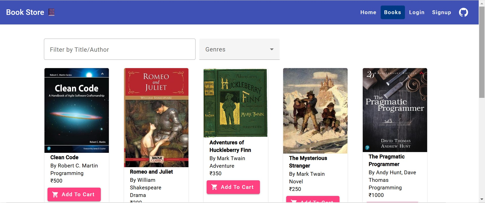

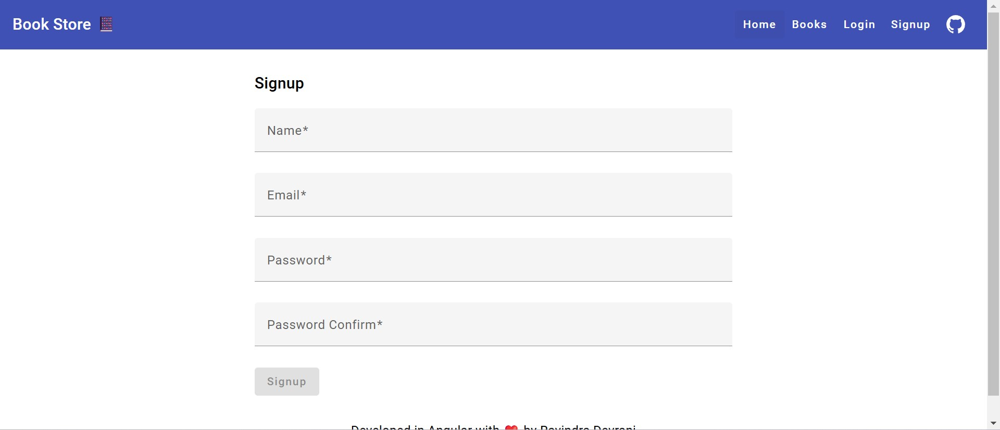

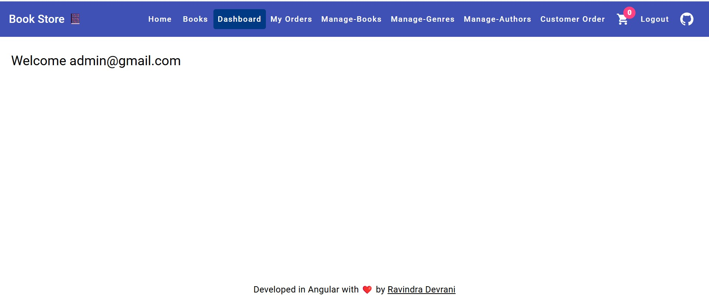

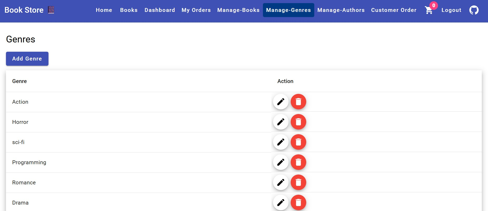

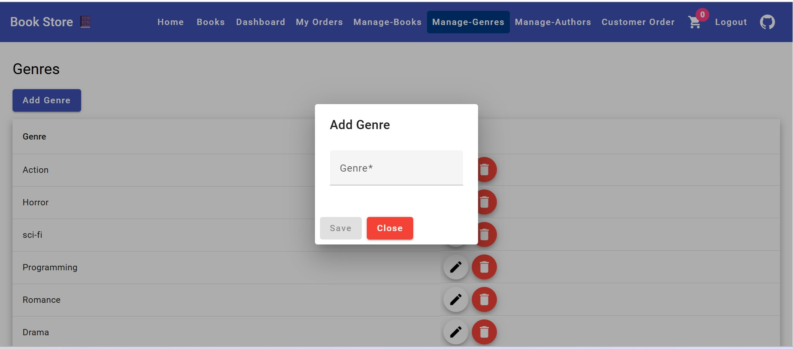

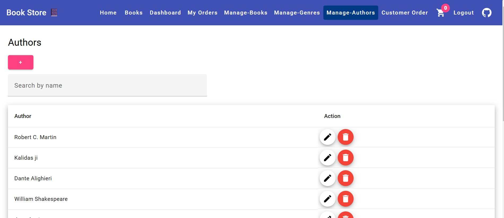

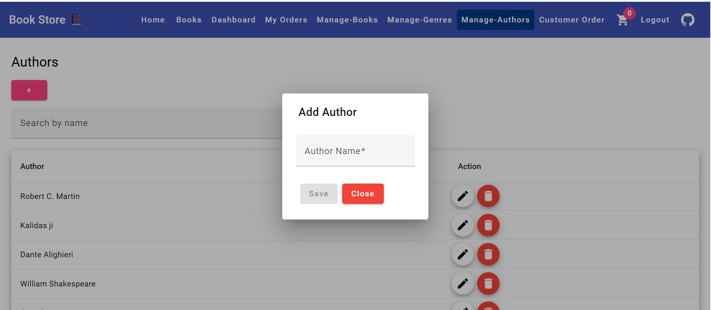

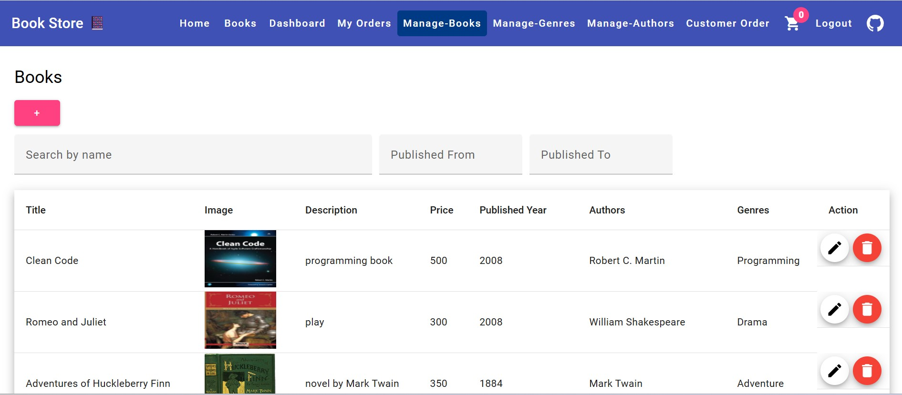

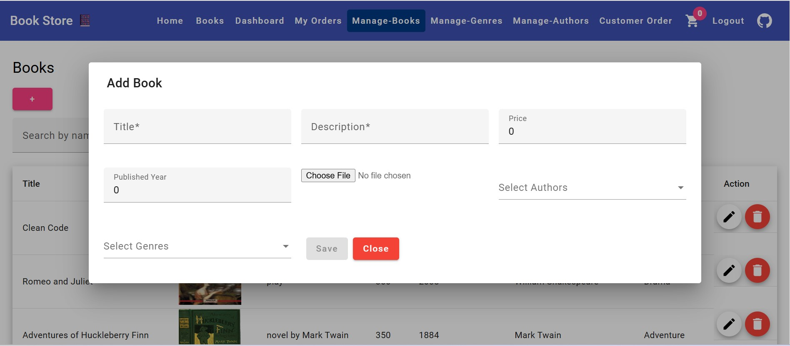

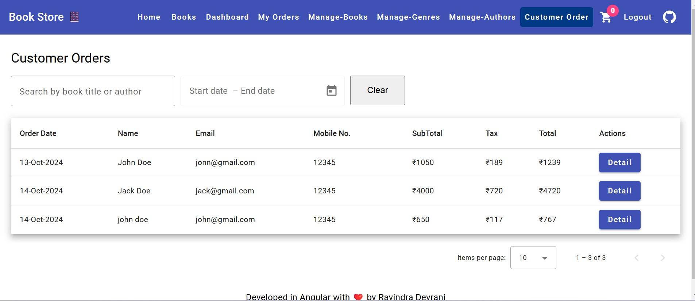

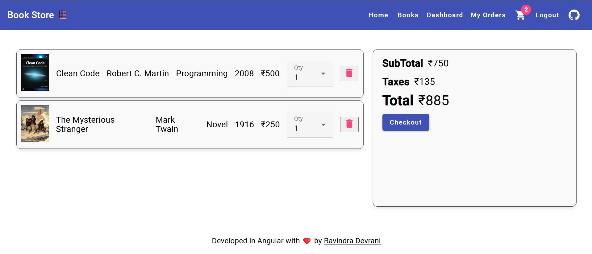

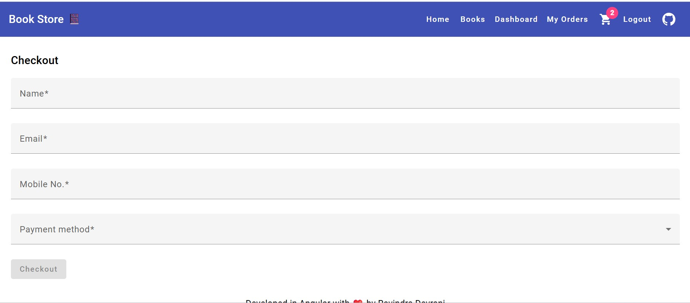

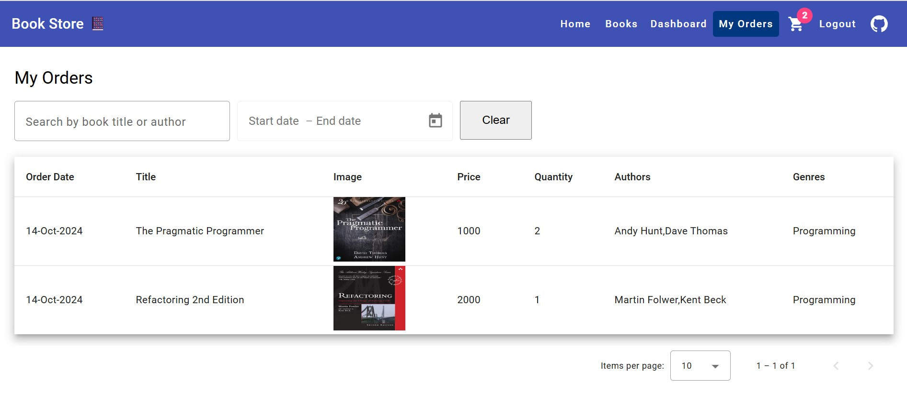
